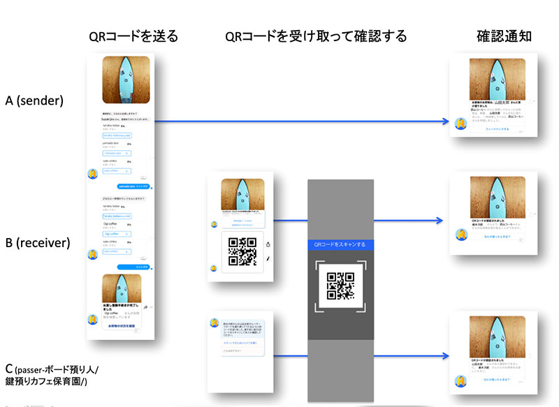

# このプロジェクトについて
これはThe Keeperというサービスです。

荷物の受け取りや受け渡し、忙しく家にいない時に不便と感じていませんか？

子供の送り迎え急な用事でできない時、猫の手でも借りたい..と感じていませんか？

The Keeperは「助けてもらいたいけど色々な人を紹介するなんて...アレンジが面倒...」な方のためのチャットボットサービスです！

# ユーザーフロー

「平日にサーフボードを渡すのは無理だ。。なぜか急に山田がサーフィンする気になってボード貸してって言っているが。。いつも暇そうな近所のカフェの店主に預けられたらな、、でも店主は山田のこと知らないから、説明が面倒だ。。諦めるしかないのか。せっかくサーフィン友達ができそうなのに><..」そんな時にThe keeperを使いましょう。

1. 依頼人はThe keeperへ受取人を連絡する
2. 受取人はThe keeperから送られたQRコードで認証を受けて受取りを完了する
3. 依頼人は受取り完了の通知を受け取る

# チーム
- Miyuki Okabe
- Michikazu Sugahara
- Shintaro Umezawa
- Koji Yamamoto
- [Yukino Kohmoto](http://yukinokoh.github.io/)

